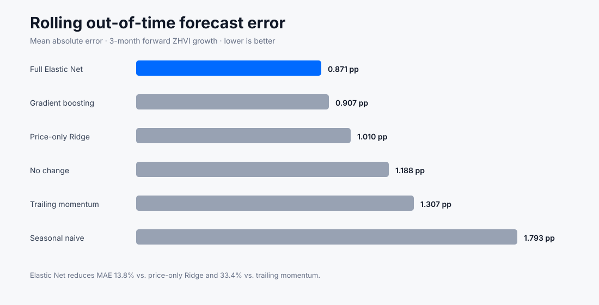
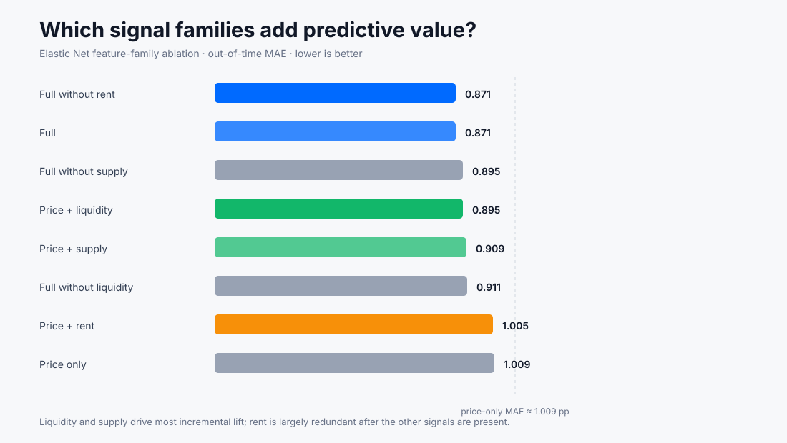
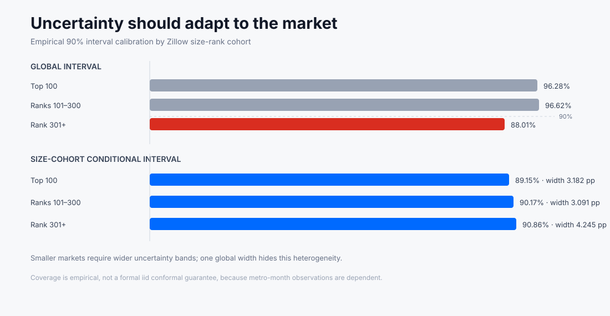

# Zillow Market Intelligence

An early-warning housing-market intelligence system designed to detect market regime shifts, forecast near-term momentum, explain predictive signals, and surface markets that deserve analyst attention.

**Live dashboard:** https://dashboard-production-b1bb.up.railway.app

**Portfolio case study:** [docs/portfolio_case_study.md](docs/portfolio_case_study.md) · **90-second demo script:** [docs/demo_script.md](docs/demo_script.md)

> **Research question:** Can leading housing-market signals identify turning points before headline home-value measures fully reflect them?

## Product

This project is built as a decision-support product rather than a standalone ML notebook. It combines market monitoring, forecasting, regime detection, interpretability, anomaly detection, and model-health monitoring into one workflow.

**Decision loop**

`Monitor → Detect → Diagnose → Forecast → Prioritize → Act → Measure`

Primary users:
- Product and strategy teams monitoring market conditions
- Data scientists and analysts investigating market changes
- Business stakeholders who need concise, interpretable market signals

## What this project demonstrates

- end-to-end data science ownership from ingestion to deployed product
- temporal validation with target-horizon purging instead of random splitting
- forecasting benchmark discipline and model-complexity restraint
- uncertainty calibration and heterogeneous error analysis
- interpretable regime design plus transition-risk modeling
- explicit alert-policy precision/recall trade-offs
- publication-lag stress testing and failure-mode analysis
- production-minded CI, deployment, health checks, and live model-health communication

## Why this matters

Housing-market conditions are distributed across multiple signals: prices, rents, inventory, price cuts, listing velocity, and other market-activity metrics. Looking at one metric in isolation can make turning points visible only after they are already underway.

The project tests whether leading supply and liquidity indicators add incremental predictive information beyond historical price momentum.

## Core hypothesis

`H1: Supply and liquidity indicators improve out-of-time prediction of future market momentum beyond autoregressive price-only baselines.`

Primary target:

`3-month forward ZHVI growth = ZHVI(t+3) / ZHVI(t) - 1`

Secondary target:

`P(next market regime | current regime, current market signals)`

## Architecture

```text
Zillow Research data
        ↓
Raw ingestion
        ↓
Schema + quality validation
        ↓
Canonical market/month tables
        ↓
Feature engineering
        ↓
┌────────────────────┬────────────────────┐
│ Market diagnostics │ Forecasting        │
│ Regime detection   │ Uncertainty        │
└────────────────────┴────────────────────┘
        ↓
Interpretation + anomaly detection
        ↓
Decision / attention layer
        ↓
Interactive dashboard
        ↓
Model monitoring
```

## Analytical stack

- **Python:** pandas, NumPy, scikit-learn, statsmodels
- **SQL:** DuckDB for reproducible local analytical marts
- **Visualization:** Plotly / Streamlit
- **Modeling:** regularized linear baselines + gradient boosting
- **Validation:** rolling-origin / walk-forward evaluation
- **Testing:** pytest + data-quality assertions
- **CI:** GitHub Actions

## Data

The project will use publicly available Zillow Research datasets at compatible geographic and temporal grains, including where available:

- Zillow Home Value Index (ZHVI)
- Zillow Observed Rent Index (ZORI)
- Inventory
- New listings
- Price cuts
- Days to pending
- Sale-to-list ratio
- Other market activity indicators

Raw source files are intentionally excluded from Git history. See [data/README.md](data/README.md).

## Repository structure

```text
zillow-market-intelligence/
├── config/             # Project configuration
├── data/               # Raw/interim/processed data conventions
├── dashboard/          # Interactive product UI
├── docs/               # Methodology, architecture, model card
├── models/             # Serialized model artifacts (ignored by default)
├── notebooks/          # Research notebooks, not production logic
├── outputs/            # Figures and reports
├── sql/                # Staging, mart, and quality SQL
├── src/                # Reusable production code
├── tests/              # Unit and data-contract tests
└── .github/workflows/  # CI
```

## Project milestones

### v0.1 — Data foundation
- [x] Lock initial Zillow Research source contract
- [x] Build reproducible ingestion pipeline + SHA-256 download manifest
- [x] Implement wide-to-long metro-month normalization
- [x] Add schema and data-quality validation
- [x] Implement canonical analytical mart builder
- [x] Add coverage-audit report generator
- [x] Execute the full build against current Zillow releases and review coverage
- [x] Promote price-cut share and new listings after live coverage audit
- [x] Keep sale-to-list and affordability as optional/contextual signals
- [x] Validate temporal alignment and document revision-vintage leakage
- [x] Publish final v0.1 data-audit report

### v0.2 — Market diagnostics
- [x] Cross-market and metro EDA
- [x] Seasonality and synchronized-shift analysis
- [x] Pooled + decomposed lead-lag exploration
- [x] Zillow size-rank cohort analysis
- [x] Top-100 metro market matrix
- [x] Lock feature hypotheses for forecasting

### v0.3 — Forecasting
- [x] Define leakage-safe feature set
- [x] Build naive and autoregressive baselines
- [x] Add Elastic Net benchmark
- [x] Add gradient-boosting challenger
- [x] Implement target-horizon-purged rolling-origin evaluation
- [x] Run feature-family ablation
- [x] Add empirical uncertainty intervals
- [x] Add size-cohort conditional calibration
- [x] Publish final forecasting findings

### v0.4 — Regimes & early warning
- [x] Define interpretable market states
- [x] Compare rule-based vs unsupervised regimes
- [x] Measure state persistence and forward-outcome separation
- [x] Model 1–3 month cooling-entry risk
- [x] Measure precision / recall / false alerts
- [x] Measure realized alert lead time
- [x] Add balanced and precision-oriented alert policies

### v0.5 — Product dashboard
- [x] Executive market monitor
- [x] Market explorer
- [x] Metro deep dive
- [x] Drivers / explanations
- [x] Alerts
- [x] Model health
- [x] Live scoring bundle + dashboard smoke test

### v1.0 — Portfolio release
- [x] Final model card
- [x] Publication-lag stress test
- [x] Forecast failure analysis
- [x] Early-warning failure analysis
- [x] Limitations
- [x] Live deployment
- [x] Portfolio case study
- [x] 60–90 second product demo script
- [ ] GitHub v1.0.0 release/tag

## Scientific guardrails

This project deliberately separates three different claims:

1. **Descriptive:** what changed in the observed data?
2. **Predictive:** which signals improve out-of-time forecasts?
3. **Causal:** did a specific external intervention cause a change?

Feature importance is not treated as causal evidence. Causal analysis, if added, will use a separate identification strategy with explicit assumptions and robustness checks.

## Evaluation principles

A model is useful only if it beats reasonable alternatives. All models will be compared with simple baselines such as persistence, trailing momentum, and seasonal naive forecasts.

Random train/test splitting is not used for forecasting. Evaluation is temporal and out-of-time.

Performance will be analyzed globally and by:
- metro
- region
- volatility cohort
- market regime
- historical period

## Intended use

This is a research and portfolio project using public aggregate market data. It is not a Zillow internal system, does not use private Zillow product telemetry, and should not be interpreted as individualized financial or real-estate advice.

## Reproduce the v0.1 data foundation

```bash
pip install -r requirements.txt
python -m src.ingestion.download
python -m src.transformation.build_interim
python -m src.transformation.build_mart
python -m src.validation.audit
```

Or run:

```bash
bash scripts/build_v01_data.sh
```

The raw downloads are not committed to Git. Each run records source URL, timestamp, file size, and SHA-256 hash in the local download manifest.

## Forecasting result

The first out-of-time forecasting experiment is complete.



Across 42,910 validation predictions and 8 purged rolling-origin folds:

- Full Elastic Net MAE: **0.871 pp**
- Gradient boosting MAE: **0.907 pp**
- Price-only Ridge MAE: **1.010 pp**
- Trailing-momentum MAE: **1.307 pp**
- Elastic Net improves MAE by **13.8% vs. price-only Ridge**
- Elastic Net improves MAE by **33.4% vs. trailing momentum**

The more complex nonlinear model does not win. At this stage, the regularized linear model is the stronger default.

### What adds predictive value?



Out-of-time ablation shows that supply and liquidity features provide most of the incremental lift beyond price history. Rent momentum is descriptively useful, but largely redundant once the rest of the feature set is present.

### Uncertainty is market-dependent



One global interval overcovers larger metros and undercovers smaller ones. Size-cohort conditional calibration brings empirical coverage much closer to the 90% target while widening intervals where forecast error is structurally larger.

## Current status

**v0.1 Data Foundation: COMPLETE.**  
**v0.2 Market Diagnostics: COMPLETE.**  
**v0.3 Forecasting: COMPLETE.**

The project now has a reproducible data foundation, market diagnostics, a leakage-safe forecasting benchmark, feature-family ablation, temporal stability analysis, and calibrated empirical uncertainty.

See:
- [Final data audit](docs/data_audit_2026-09-18.md)
- [Market diagnostics findings](docs/market_diagnostics_2026-09-18.md)
- [Forecasting findings](docs/forecasting_2026-09-18.md)

## Regimes & early warning

The regime layer is now live.

The transparent rule system produces five states:

`accelerating · tightening · balanced · loosening · cooling`

Rule-based states are more persistent than the unsupervised KMeans comparator:

- Rule-based one-month persistence: **77.0%**
- KMeans one-month persistence: **66.2%**
- KMeans silhouette score: **0.194**

The states also separate forward outcomes. Markets classified as accelerating average **+2.27%** forward 3-month ZHVI growth, while cooling markets average **+0.67%** and have a **34.8%** probability of negative forward growth.

For transition risk, the early-warning model predicts entry into a cooling state within the next 1–3 months.

Two alert policies are retained:

- **Balanced/F1 policy:** 33.8% precision, 62.7% recall, median lead time 2 months
- **Precision-oriented policy:** 51.4% precision, 19.8% recall, median lead time 1 month

The ranking signal is meaningful (ROC AUC **0.804**, average precision **0.389** vs. a 12.9% event rate), but the alert trade-off is explicit: higher precision materially reduces recall.

## Current status

**v0.1 Data Foundation: COMPLETE.**  
**v0.2 Market Diagnostics: COMPLETE.**  
**v0.3 Forecasting: COMPLETE.**  
**v0.4 Regimes & Early Warning: COMPLETE.**

See:
- [Final data audit](docs/data_audit_2026-09-18.md)
- [Market diagnostics findings](docs/market_diagnostics_2026-09-18.md)
- [Forecasting findings](docs/forecasting_2026-09-18.md)
- [Regimes and early-warning findings](docs/regimes_2026-09-19.md)

## Product dashboard

The v0.5 Plotly + Streamlit application now turns the analytical system into a live decision-support workflow:

- **Executive Monitor** — regime mix, current forecast distribution, priority metros, and transition risk
- **Market Explorer** — filter and compare metros across momentum, supply, and risk
- **Metro Deep Dive** — forecast interval, historical conditions, diagnostics, and local Elastic Net feature contributions
- **Alerts** — current precision-oriented cooling-transition alerts
- **Model Health** — out-of-time benchmark performance, calibration, validation design, and visible limitations

Current dashboard scoring is generated from the real Zillow mart at runtime. Forecast uncertainty is calibrated on a purged recent holdout window rather than in-sample residuals, and metro prioritization uses transparent tiers instead of an arbitrary weighted score.

Run locally:

```bash
python -m src.ingestion.download
python -m src.transformation.build_interim
python -m src.transformation.build_mart
streamlit run dashboard/app.py
```

## Current status

**v0.1 Data Foundation: COMPLETE.**  
**v0.2 Market Diagnostics: COMPLETE.**  
**v0.3 Forecasting: COMPLETE.**  
**v0.4 Regimes & Early Warning: COMPLETE.**  
**v0.5 Product Dashboard: COMPLETE.**

## Release hardening

The v1.0 analytical release gate is complete.

Publication-lag sensitivity for the selected Elastic Net forecast:

| Scenario | MAE | Directional accuracy | MAE degradation |
|---|---:|---:|---:|
| Contemporaneous features | 0.871 pp | 77.4% | 0.0% |
| Non-price signals lagged 1M | 0.928 pp | 76.5% | +6.6% |
| Non-price signals lagged 2M | 0.989 pp | 76.2% | +13.5% |
| All dynamic signals lagged 1M | 1.143 pp | 70.4% | +31.2% |

These are operational stress scenarios, not claims about Zillow's actual publication SLA.

Failure analysis identifies the contexts where confidence should be reduced:

- high-volatility quartile: **1.276 pp MAE**
- cooling regime: **0.989 pp MAE**
- rank-301+ metros: **0.952 pp MAE**
- worst validation fold: **1.347 pp MAE**
- precision-oriented early-warning policy misses **80.2%** of realized cooling entries
- **48.6%** of precision-oriented alerts are false positives

This defines the operating envelope: use forecasts and transition probabilities for prioritization, preserve uncertainty, and lower trust in small/high-volatility markets and under delayed-data scenarios.

See [release hardening findings](docs/release_hardening_2026-09-19.md).

## Portfolio release status

**Live deployment: COMPLETE.**  
**Case study: COMPLETE.**  
**Demo script: COMPLETE.**  

The remaining repository-level release step is the GitHub `v1.0.0` tag/release.
